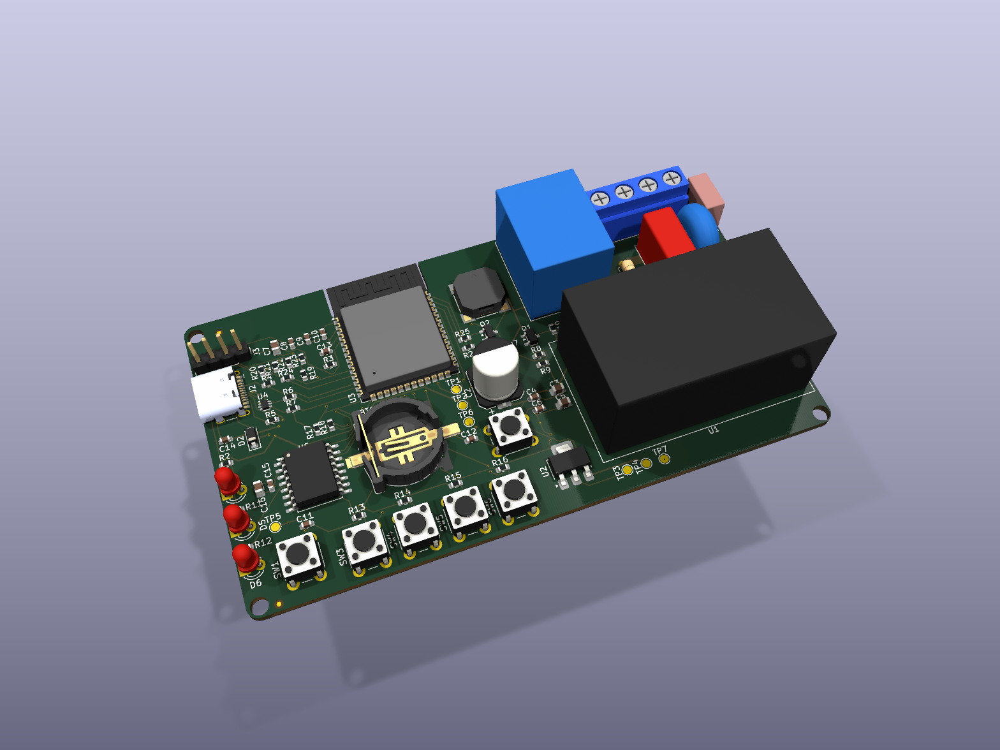

# ViRa AI Plug

A 2-layer ESP32-S3 mains smart plug: an HLK-5M05 isolated module drops 230 V AC to 5 V, an AMS1117 supplies the ESP32-S3-WROOM-1, and an SRD-05VDC relay switches the outlet through a low-side AO3400A MOSFET with a flyback diode and status LED. A DS3231M with a CR1220 backup cell keeps time for scheduled switching, with six buttons and a buzzer for local control and USB-C for programming. Designed in KiCad 10.

## Warning — mains voltage

This board carries 230 V AC. The mains and low-voltage sections are separated by a documented barrier — 6.78 mm of creepage in the open board area, enforced by `ViRa_V1.0.kicad_dru`. However the tightest mains-to-low-voltage gap is **2.10 mm**, at the relay's mains common pad, which is below the 2.5 mm functional minimum and needs the relay or the power module re-placed to fix. It has not been fabricated or tested. Do not connect it to mains.

Circuit topology follows the open-source Zeen-AI-Plug smart plug.
